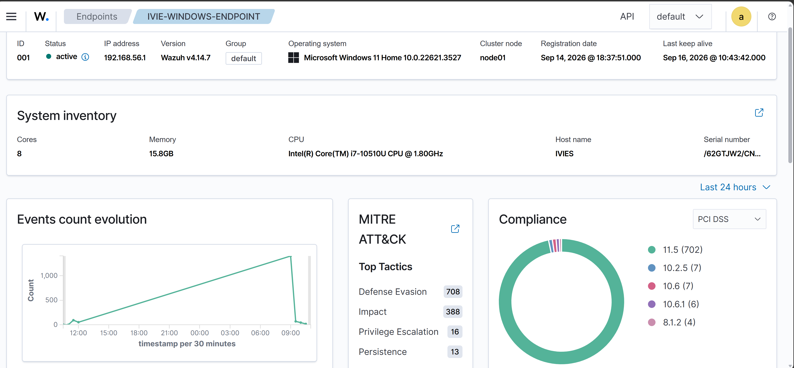
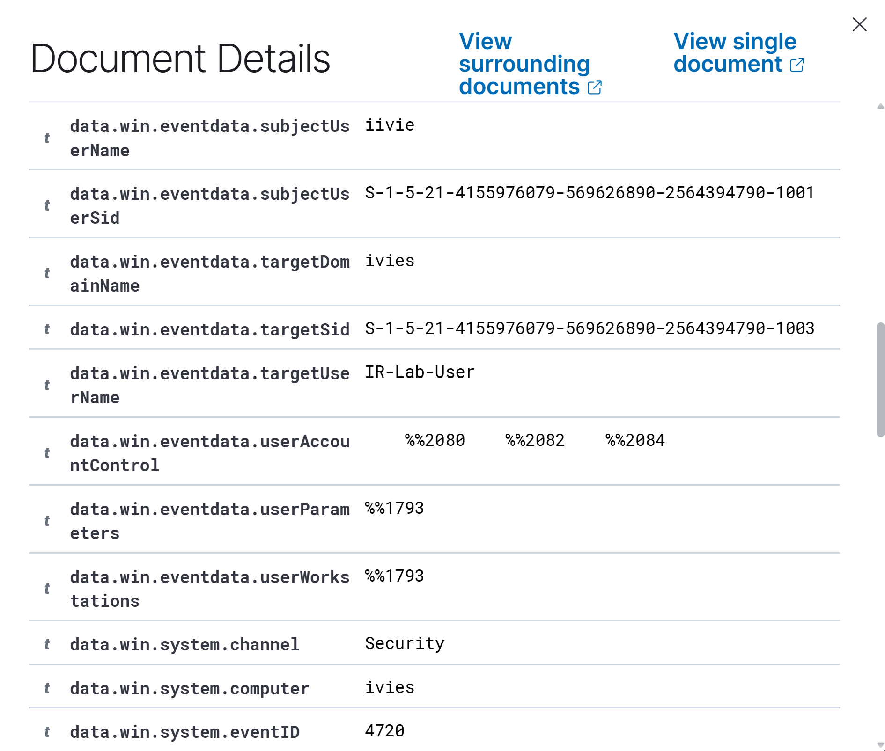
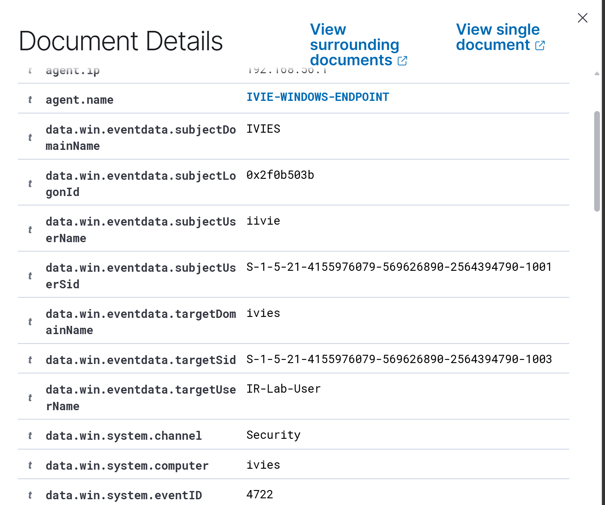
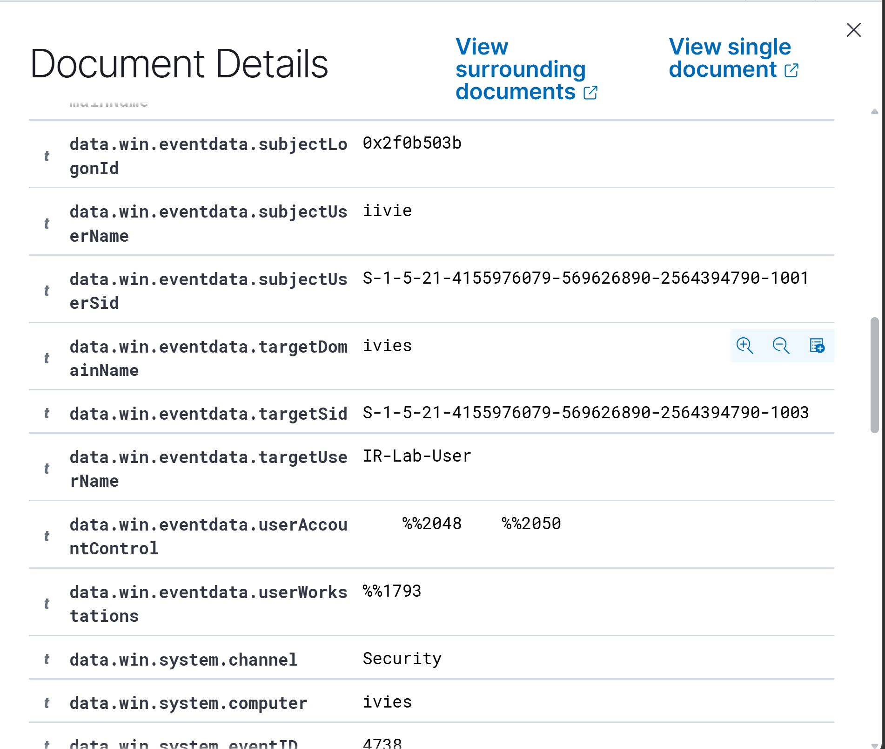

# Windows Account Creation & Privilege Escalation — SOC Investigation

> **Wazuh SIEM | Windows Security Logs | Incident Response | MITRE ATT&CK**

## Overview

This project documents a controlled SOC investigation of Windows account-management activity involving the creation of a new local account and its subsequent addition to the local **Administrators** group.

Using **Wazuh SIEM** and **Windows Security telemetry**, I reconstructed the activity across multiple events and correlated the affected identity using its Windows Security Identifier (SID).

**Investigation chain**

`4720 Account Created → 4722 Account Enabled → 4738 Account Modified → 4732 Added to Administrators`

**Final disposition:** True Positive — Authorized Security Simulation

> This was a controlled lab simulation. No real compromise occurred.

---

## Scenario

A Windows endpoint generated security telemetry showing account creation and subsequent account/group changes. The investigation objective was to determine:

- Which account performed the actions
- Which account was affected
- Whether the events belonged to the same identity
- Whether privileged access was granted
- How the activity would be assessed and handled if it appeared unexpectedly in a production environment

## Lab Environment

| Component | Purpose |
| --- | --- |
| Windows 11 endpoint | Monitored host |
| Wazuh SIEM | Log collection, search, and investigation |
| Windows Security Log | Primary telemetry source |
| PowerShell | Controlled activity generation and validation |
| MITRE ATT&CK | Technique mapping |

## What I Actually Investigated

Rather than treating individual alerts in isolation, I reconstructed the activity as an incident timeline. I:

1. Established and verified endpoint telemetry in Wazuh.
2. Investigated Windows account-management events.
3. Identified the initiating user as `iivie`.
4. Identified the new account as `IR-Lab-User`.
5. Correlated events using the account SID ending in `-1003`.
6. Verified that the same SID was later added to the built-in `Administrators` group.
7. Investigated process-creation visibility using Windows Event ID 4688.
8. Documented a telemetry limitation when a test command could not be reliably correlated.
9. Assessed the security impact and developed containment/remediation recommendations.
10. Produced a formal SOC incident investigation report.

## Evidence Timeline

| Sequence | Event ID | Finding | Significance |
| --- | --- | --- | --- |
| 1 | **4720** | `iivie` created `IR-Lab-User` | Establishes creation of the local account |
| 2 | **4722** | `IR-Lab-User` was enabled | Confirms the account became enabled |
| 3 | **4738** | `IR-Lab-User` was modified | Shows subsequent account manipulation |
| 4 | **4732** | SID ending `-1003` was added to `Administrators` | Establishes administrative group membership |

## Key Analytical Finding

The strongest correlation point was the **SID**, not simply the username.

Events **4720**, **4722**, and **4738** associated `IR-Lab-User` with a target SID ending in `-1003`.

Event **4732** subsequently recorded that same SID as the member added to the built-in **Administrators** group. The target group SID was:

`S-1-5-32-544`

This allowed the events to be connected into a coherent sequence:

**account creation → enablement → modification → administrative group membership**

If this sequence occurred without authorization in a production environment, it would warrant escalation because it could provide persistent privileged access to the endpoint.

## Evidence

### 1. Wazuh Endpoint Monitoring

The Windows endpoint was enrolled in Wazuh and actively sending telemetry.

### 2. Account Creation — Event 4720

Event 4720 identified the creation of `IR-Lab-User` and provided the target SID used later for correlation.

### 3. Account Enabled — Event 4722

Event 4722 showed the same account being enabled.

### 4. Account Modified — Event 4738

Event 4738 recorded subsequent modification of the account.

### 5. Administrative Group Membership — Event 4732

Event 4732 recorded member SID ending `-1003` being added to the built-in `Administrators` group by `iivie`.

## MITRE ATT&CK Mapping

| Technique | Why it applies |
| --- | --- |
| **T1136.001 — Create Account: Local Account** | Event 4720 confirms creation of a local account |
| **T1098 — Account Manipulation** | Subsequent account and group-membership changes were observed |

## Detection Engineering Observation

During the investigation, I also examined Windows **Event ID 4688 (Process Creation)**.

Process Creation auditing was verified as enabled for successful events, and 4688 telemetry was available. However, the `whoami /priv` test command could not be reliably correlated in the available telemetry.

I therefore **excluded it from the confirmed evidence chain** rather than treating expected activity as a verified finding.

This highlighted an important investigation principle:

> A detection hypothesis is not evidence until the available telemetry supports it.

## Risk Assessment

**Simulated production severity: High**

If unauthorized, the combination of a newly created local account and subsequent membership in the local Administrators group would be security-significant.

Before declaring compromise in a real environment, additional validation would include authentication activity, process execution, initiating-user context, change authorization, and activity on other endpoints.

## Recommended Response

If the activity were unauthorized in a production environment, recommended actions would include:

- Validate whether the initiating identity was authorized to make the change.
- Isolate the affected endpoint when appropriate.
- Disable the unauthorized account.
- Remove unauthorized privileged group memberships.
- Investigate the initiating account for possible compromise.
- Review related authentication and process telemetry.
- Reset affected credentials where warranted.
- Hunt across other endpoints for related account or group changes.
- Preserve relevant logs and evidence before remediation.

## Final Disposition

**True Positive — Authorized Security Simulation**

The account-management and privileged group-membership activity genuinely occurred and was captured in Windows/Wazuh telemetry. Because the actions were intentionally generated in a controlled lab, no real compromise occurred.

## Skills Demonstrated

- Wazuh SIEM investigation
- Windows Security Event analysis
- Threat hunting
- Multi-event correlation
- SID-based identity correlation
- Privilege-change investigation
- Incident timeline reconstruction
- MITRE ATT&CK mapping
- Risk assessment
- Incident response recommendations
- Detection/telemetry validation
- Evidence-based SOC reporting

## Full Incident Report

The complete analyst report, including evidence exhibits and response analysis, is available here:

**[View SOC-IR-001 Incident Investigation Report](report/SOC-IR-001-Incident-Report.pdf)**

---

**Analyst:** Ivie Wilson  
**Case ID:** SOC-IR-001  
**Project Type:** Controlled SOC / Incident Response Lab

## Investigation Evidence

### 1. Wazuh Endpoint Overview

The Windows endpoint was successfully enrolled in Wazuh and monitored for security events.

### 2. Account Creation — Event ID 4720

Windows Security Event ID 4720 recorded the creation of the local account `IR-Lab-User`.

### 3. Account Enabled — Event ID 4722

Event ID 4722 confirmed that `IR-Lab-User` was enabled after creation.

### 4. Account Modification — Event ID 4738

Event ID 4738 recorded subsequent changes to the `IR-Lab-User` account.

### 5. Privilege Escalation — Event ID 4732

Event ID 4732 showed that the SID associated with `IR-Lab-User` was added to the local `Administrators` group.

